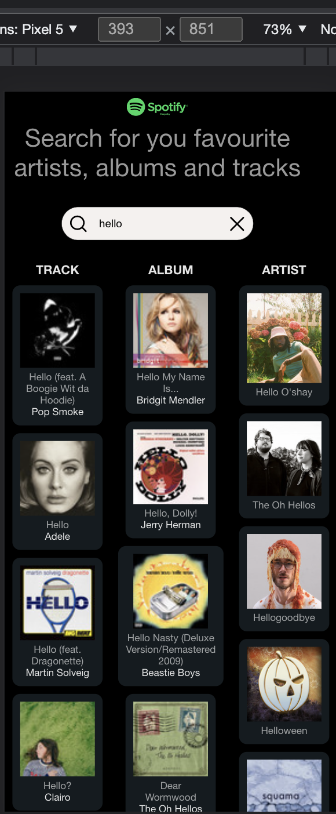
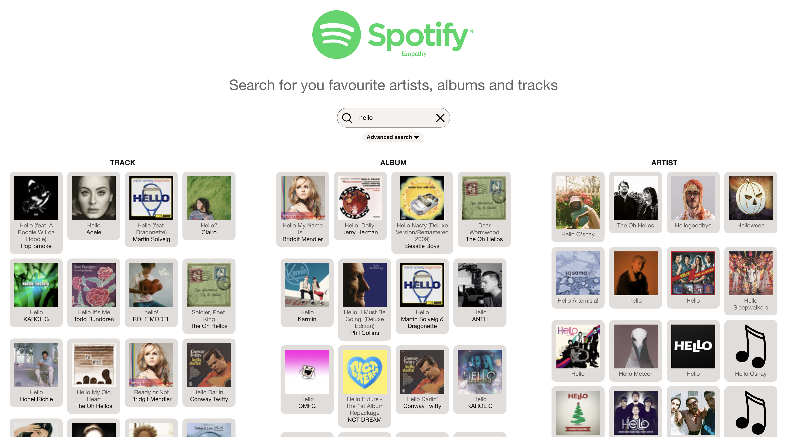
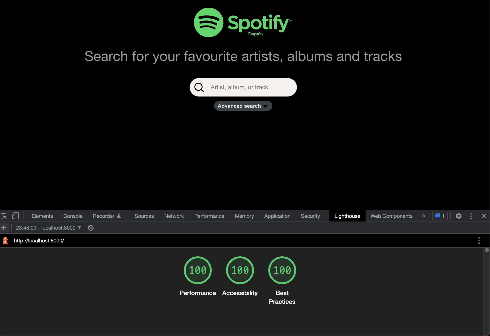
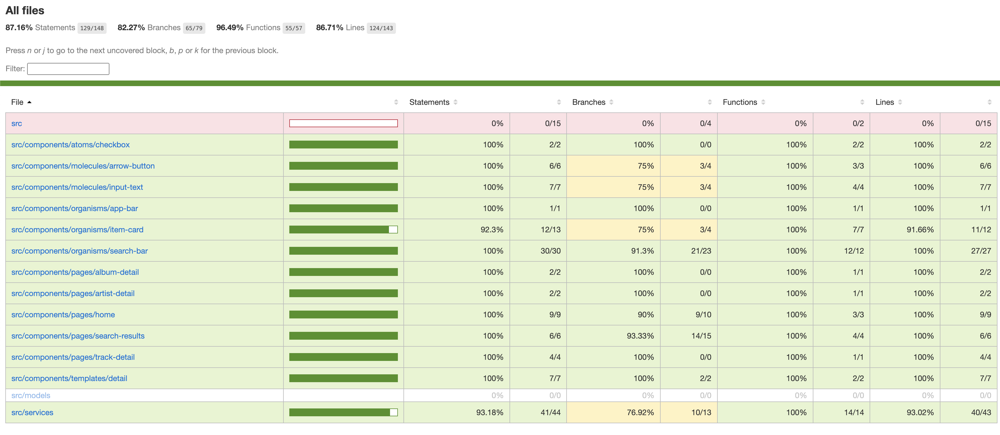
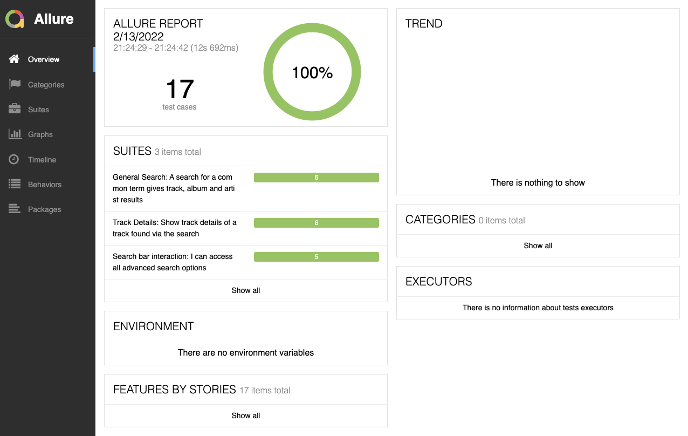

# Spotify search for artists, albums and tracks

# Overview of the exercise - Framework selection

Over the last several years, professionally, I have used Angular, but mainly Polymer and Lit Element. Even though I have only previously used React in a personal project a few years ago, I decided to devlop this exercise with React as I understood that this would be the framework to used if I were given the position. I also decided for React due to my interest in this framework.
  
# Getting started

For authentication with the Spotify API, the client credentials flow was used. The application looks for the required credentials in two environment variables: `REACT_APP_CLIENT_ID` and `REACT_APP_CLIENT_SECRET`.

As is habitual in React applications, a development server can be started with `npm run start` and the production build can be constructed using `npm run build`.

# Design

The design used was inspired by the actual Spotify site and the idea was to maintain the same "look and feel".

The style arragement was also done keeping in mind the possibility of enabling a least light / dark theming option. Given more time, I would have added an icon on the interface so the user could easily change from one theme or the other. As the theme colors are defined using CSS variables this could be done dynamically easily enought. At the moment, the theme is set programatically in the main `index.tsx` file.

Styles have been applied using classes and a careful naming convention has been used in order to scope the styles to the components for which they are intended for.

CSS features such and flex and grid have been used for positioning in several instances. A transition has been applied while opeing/closing the advanced search options.

A responsive design concept has been taken into consideration, so that the application could offer an agreeable user experience in different screen dimensions.

Accessibility criteria has also been taken into consideration.

  

# Architecture

The composition of the React Components has been done according to the `Atomic Design Pattern` of atoms, molecules, organisms, templates and pages. If the scope of the application been larger, more components in each category would have been developed in order to facilitate the reuse and hierachical composition of the components.

`Interfaces` that are reused in the project have been separated into their own file and folder for easy localization and reuse of common Typescript interfaces.

In the `services` folder, the Spotify API interaction, routing, localization and theming utilities are found.

SVG files are found in their own `assets` folder.

The components are React class components, however, given more time, I probably would have created more function based components, in order to more precisely separate `presentational` components from `container` components and to be able to interact with React hooks in an easier fashion. It has been during development that I have gotten to know better some of these more recent React features.

There are several pages defined in the application, the Home component being the main one, as it renders the App bar, which is always visible in all pages of the application, and it offeres the "Outlet" through which the other pages are displayed. Search results are also keep in the page state even when the user navigates away to one of the detail pages, so that when he/she returns to the home page, the results of the previous search are still visible.

The three detail pages (track, album and artist) are similar, and only offer differences in some data fields and the type of media player they use, which is why they are basically container components, and they all use the same base "detail" template component.

All texts are localized and provided in two languages, English and Spanish (others could be added easily), English being the default. Usually, the language setting would be obtained from the user's browser settings or a configuration option where the user could select his/her preference. However, given time restrictions and the limited scope of the exercise, it is now set programatically in the `index.tsx` file.

Coding style used in the application is meant to be declarative, in the sense that you should be able to read and understand the code without delving into all the techical detail, due to sensible decoupling and meaningful function and variable naming and design patterns. While writing functions and methods, they are meant the be as "pure" as possible, reducing side effects and offering clarity and consistency in their respective inputs and outputs.

Typescript has been used in the project. It is true that Typescript does imply more coding to add the "types" and interfaces to the code, however, in many cases it can reduce development work as it detects and identifies possible problems almost immediately, otherwise possibly not surfacing until runtime or being of difficult detection.

# Performance considerations

For a better user experience, in order to perform the search, the user is not obliged to click a submit button or to press "enter". The API call is fired automatically after the user starts entering text. However, in order to avoid sending numerous API calls when perhaps the user is still typing, the application waits for the user to at least pause typing before sending the search request.

The data received from API search call is then used not only for the search results screen, but also for the detail screen, not making other API calls necessary and therefore improving performance.

When showing search results, the URL of the smallest image offered by the API is used, as this is always going to be shown in small dimensions. This also avoids unnecessary image loading times.

Even so, while the images of the search results are loading, so as not to delay user interaction and so that the positioning of the results doesn't change continually as the images are loaded, a fallback image is used as a first image for all item results, and then as the images are loaded they fallback images are replaced by the "real" ones.

Lighthouse report performed on production build.

# Unit / Integration Tests

The tests can be run using and the coverage report generated using `npm run test:coverage`. The coverage reports can then be inspected by opening `coverage/lcov-report/index.html` in a browser.

The tests developed for this exercise are often more integration tests than unit tests. While these kind of tests are useful to give garantees, not only of individual functions and methods work as desired, but the interaction of different components responde correctly to the functional specifications, it is also useful to have a more complete coverage with unit tests. On the other hand, the React Testing Library seem to promote a more integrated style of tests so they reproduce more closely the user experience.

# End to End Tests

End to end tests can be found and an accompanying project, in the `e2e` folder. Dependencies must be installed with `npm install`.

Two convenience scripts can be found:
-  `npm test` will run the end to end tests
- `npm run report` will generate the Allure test reports and open them in the default browser

The End to End test project is built with WebDriver.IO and uses Cucumber as a test runner. This way the features which define the functionality the application is to fulfill can be dicted by business analysts and reducted with the development team so that the automated tests can verify this functional specification with a complete browser interaction including, if desired (as is this case), real API calls.

  
# Conclusion

Given more time, there are many improvements that I would make to this project, functionally and technically, however, I believe the objectives have been well met. Having been developing mainly with web components for the last several years, where the shadow DOM gives the guarantee of style isolation, in these projects, we have not found so useful SASS features such as mixins and functions, however, if I were working with a framework such as React where a styling system for large applications is quite necessary I would certainly delve more deeply into these tecniques.

